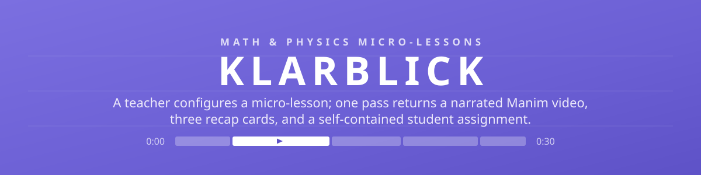
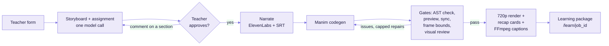
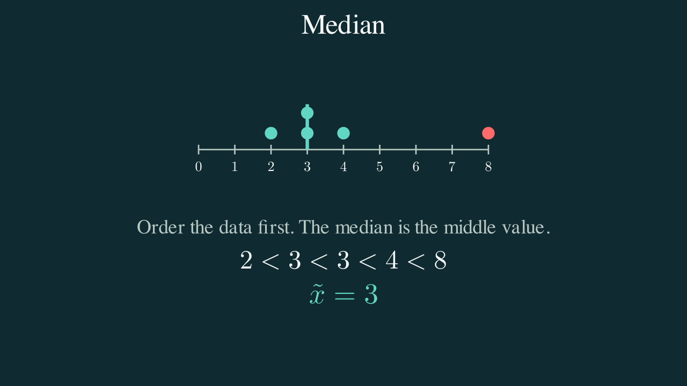
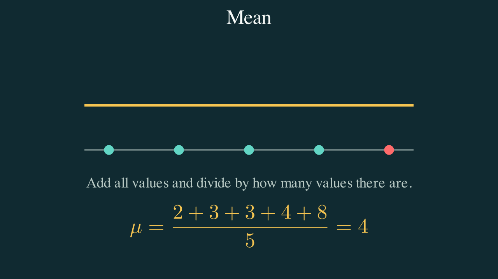
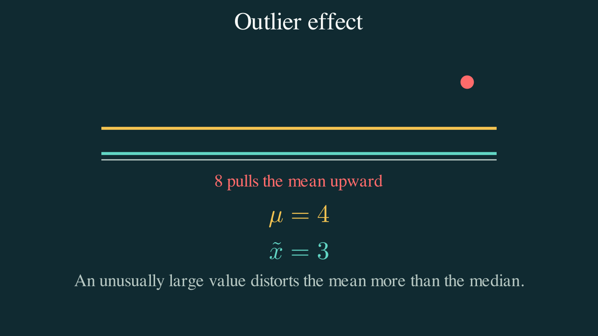
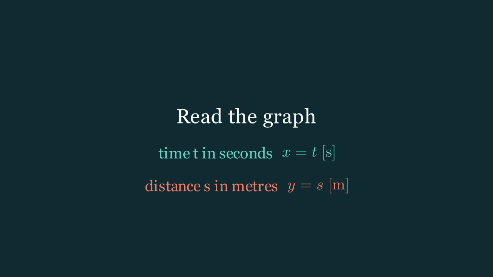
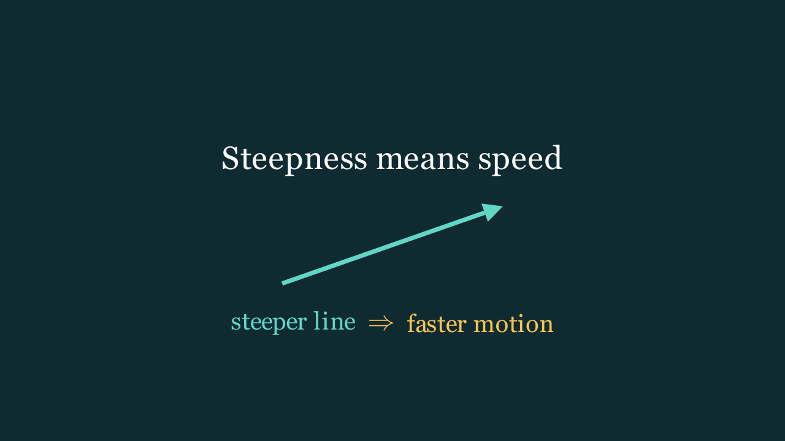
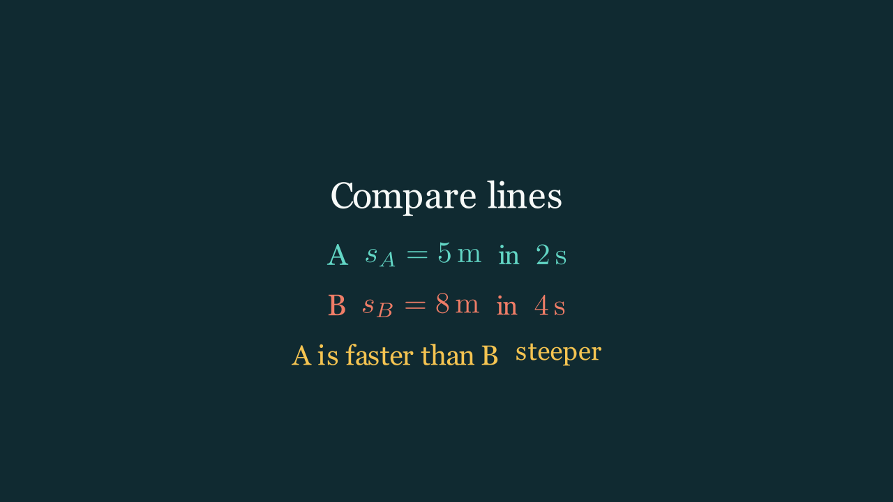

<!-- palette: primary #7B6FE0 · primary-dark #5E52C7 · ink #1D1A3F · tint #EDEAFA · lavender #F4F1FB — derived from the project's real brand (apps/web/app/globals.css :root tokens), rule zero step 1 -->

<div align="center">
  

  <p>
    
    
    
    
    
    
    
  </p>
</div>

Klarblick is a local hackathon application for mathematics and physics teachers at a German Gymnasium. A teacher configures a micro-lesson, reviews the AI storyboard section by section, and one approval produces everything the class needs: a narrated Manim video with burned-in captions, three recap cards, and a self-contained student assignment — all generated in the same pass, all in English. See [docs/SETUP.md](docs/SETUP.md) for a one-page map of the pieces.

> [!TIP]
> **See it work without spending a cent.** The focused checks run in seconds and are free:
> `.\.venv\Scripts\python.exe -m unittest discover -s tests -v` — and the seeded "Rainfall report"
> demo at `/assignments` opens without any provider keys. If a hero-lesson render fails, the app
> serves the prepared bundle in `fallback/` instead of erroring, so the demo never dies on stage.

## The teacher's loop

1. **Configure** — grade, topic, subtopic, teaching method, on `http://localhost:3000`.
2. **Review** — the storyboard arrives already self-reviewed by a second model call; comment on any single section and only that section is regenerated.
3. **Approve** — a background render job starts; the UI shows one segment per scene, sized by its real duration.
4. **Teach** — the lesson package publishes video, recap cards, and the linked assignment. Students **Watch**, **Work**, answer spoken **Questions**, and see their **Mark** at `/learn/{job_id}`.

Every follow-up question a student hears is first checked by a deterministic grounding gate (`services/api/app/probe.py`): its quoted span must literally occur in the student's own writing, or the question is never asked.

## Architecture



Two of those gates are deterministic and run before any paid visual review: one compares animation length with narration length so picture and speech cannot drift apart; the other samples one frame per section and rejects any frame whose outer two percent contains lesson content. The lower caption band (`y = -4.0` to `-3.0`) is kept clear for FFmpeg.

> [!NOTE]
> Manim runs as a local subprocess after AST validation, with a sanitized environment that
> carries no model or ElevenLabs credentials. There is no Docker, database, or queue —
> job state is JSON files under `jobs/`.

## What comes out

| | | |
|:---:|:---:|:---:|
|  |  |  |
|  |  |  |
| *Real recap cards from the committed hero bundles — math above, physics below.* | | |

Each lesson also ships an assignment written in the same model call as the storyboard: a fresh worked example (never the video's own), and three to five tasks split between `ai_assistable` mechanical work and `core` reasoning — at least two core tasks, checked before the render even starts. Written work and spoken answers are weighted into one score (`assignment_probe_weight` in `settings.py`).

## Quickstart

1. Copy `.env.example` to `.env`; set `MODEL_NAME`, the matching provider key, `ELEVENLABS_API_KEY`, and `ELEVENLABS_VOICE_ID`.
2. Install `uv`, Node.js 22+, and MiKTeX.
3. From the repository root:

   ```powershell
   uv python install 3.12 --no-registry --no-bin
   uv venv --python 3.12 .venv
   uv pip install --python .venv\Scripts\python.exe -r services\api\requirements.txt
   npm install --prefix apps\web
   ./scripts/check-prereqs.ps1     # let MiKTeX finish its first-run setup
   ```

4. Run the two processes and open `http://localhost:3000`:

   ```powershell
   ./scripts/start-api.ps1   # terminal 1 — FastAPI on :8000
   ./scripts/start-web.ps1   # terminal 2 — Next.js on :3000
   ```

After selecting the ElevenLabs voice, build the cached hero bundle once with
`.\.venv\Scripts\python.exe scripts\build_hero_fallback.py`.

> [!IMPORTANT]
> `scripts\run_live_smoke.py` exercises the single paid end-to-end path. Run it only when
> **both** the model provider and ElevenLabs are configured — it spends real API credit.

## Credits

Built for a hackathon, on the shoulders of [Manim Community](https://www.manim.community/), [ElevenLabs](https://elevenlabs.io/), [FastAPI](https://fastapi.tiangolo.com/), and [Next.js](https://nextjs.org/). Scope and sprint plan in [docs/plan.md](docs/plan.md); assignment feature notes in [docs/2026-08-15-assignment-feature.md](docs/2026-08-15-assignment-feature.md).
